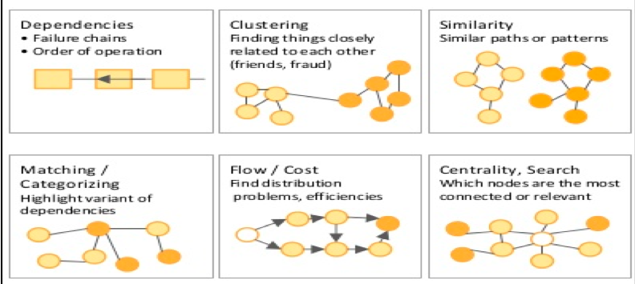
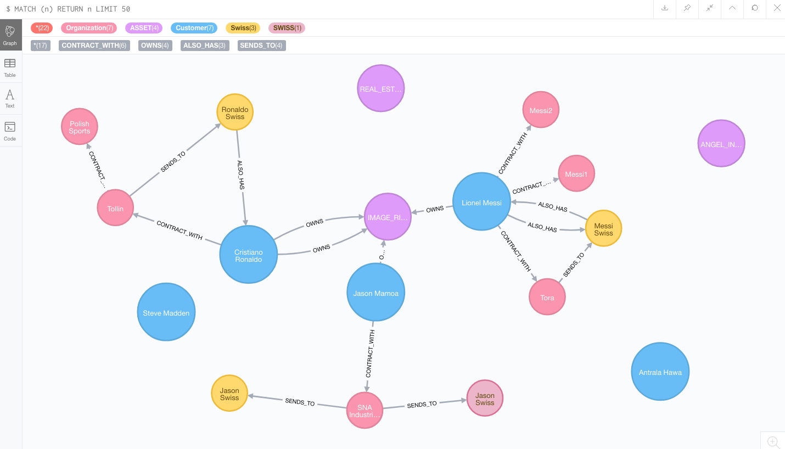
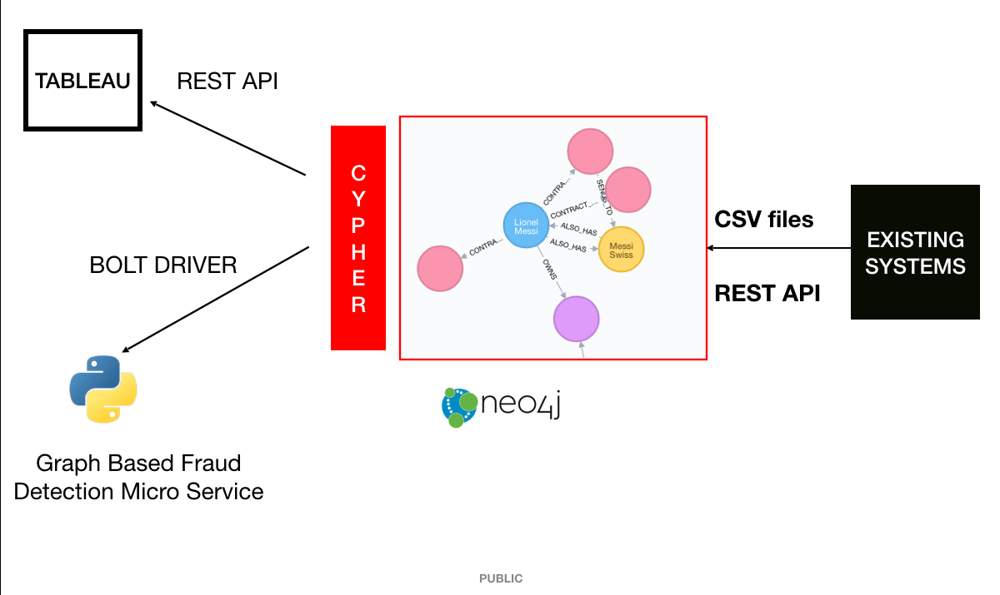
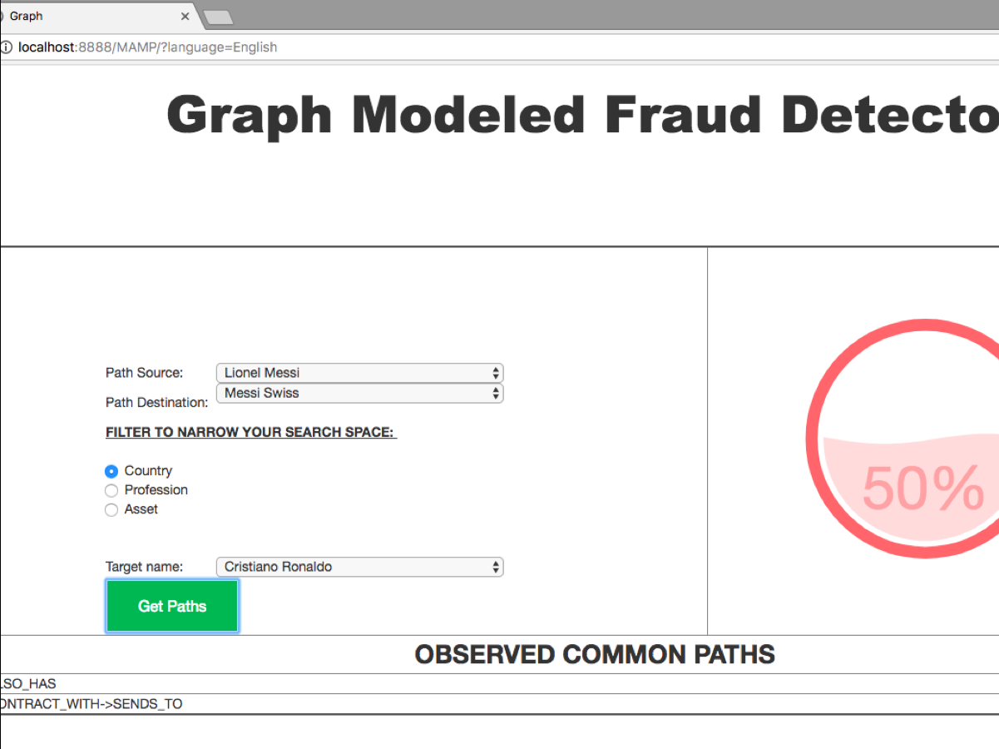

# Banking Fraud Prevention using Graph Data Models

This project was used in HSBC India's first of its kind hackathon. The 48 hour hackathon had around 300 participants and this project emerged as one of the winners. 

## IDEA

Banking Fraud occurs in many ways, some use cases are included below - 

1. Money Laundering
2. Tax Evasion 
3. Credit Card Fraud.

While these are carried out in extraordinarily different ways by criminals, we believe that patterns exist in most of them. These patterns may not be visible when data is stored in a relational rather linear database , but can be captured when data is stored differently. 

Thus we want to create a knowledge graph , that focusses on the customers relationships and activities rather than just storing it as another record. This knowledge graph in turn would help match patterns of already existing frauds , thus allowing the bank to take better precautionary measures. We attempt to use various graph analytics methodologies to look for patterns

#### Graph Analytics methodologies

Here's what a graph in the banking world looks like -

## Technologies used

-   Neo4j : Graph Database
-   Python : Programming Language
-   CYPHER : Graph Query Language
-   Flask : Microframework in Python used as a controller in our web application.
-   MAMP : Server used in order to host our Python application.

## Architecture

## Final Look at the application

A meter tells how much the target customer's behavior matches to that of the fraudulent one. 

## Further problems to address

The major problem that arises with such issues is that of scale. There is a high chance that this recommendation engine would generate false alerts. Further research must incorporate a mechanism to narrow down our search space , and use Machine Learning to better see which patterns in the graphs must be taken seriously. 
